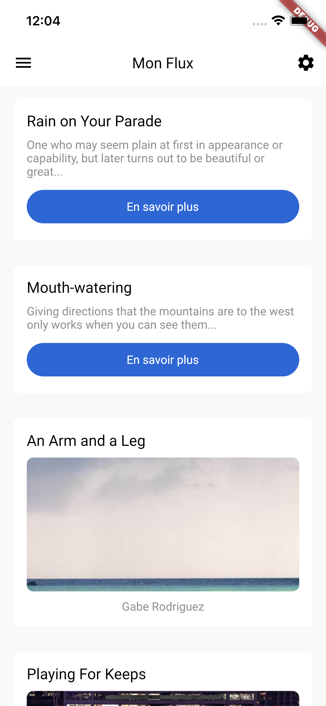
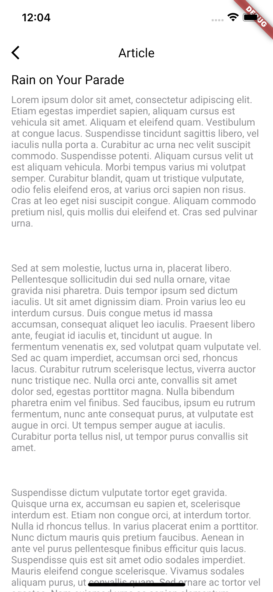
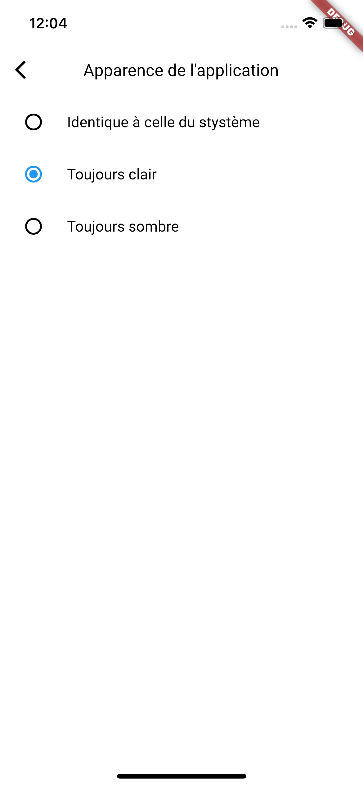
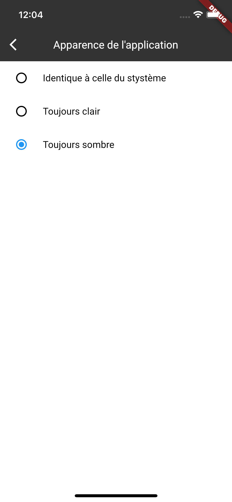
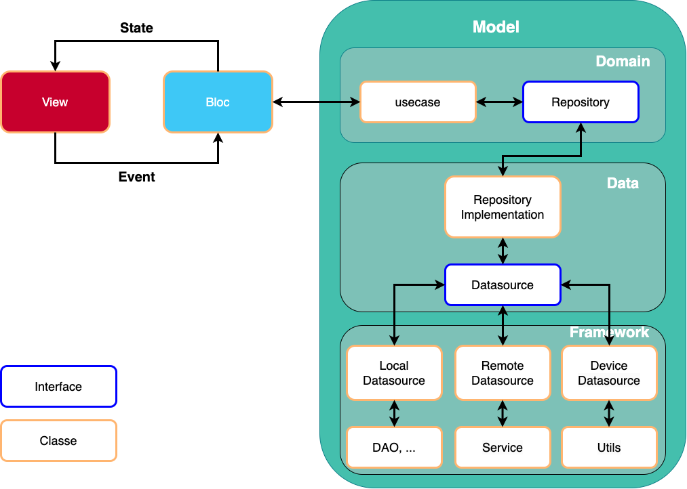
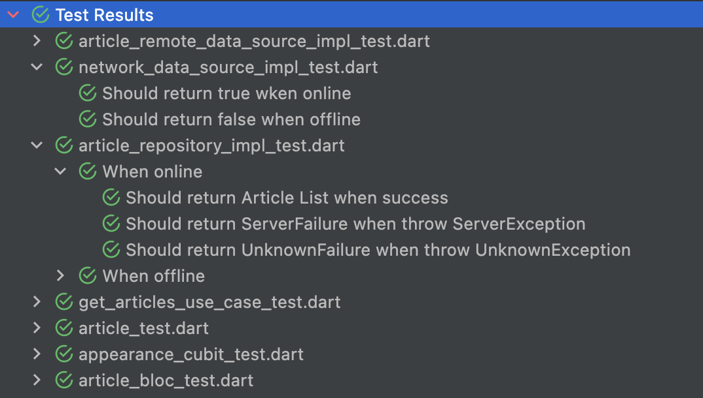

# Test On Mars

**Running application**

**FVM :**
Install fvm [here](https://fvm.app/docs/getting_started/installation)

    fvm config
	fvm use 3.7.1

---

## Features

- Create with Very Good Core template
- Bloc state management
- Freezed package
- Material 3 theming
- Loader while requesting API
- Appropriate error message if API fails
- Detail page navigation on widget tap
- Unit tests
- Internationalization (en/fr)
- Infinite scroll list
- Animations (with Hero widget)
- Cache library for images (with FadeInImage widget)
- Settings button to switch between light and dark mode (only for the AppBar color)

## Screenshots

## Architecture

## Unit-tests

